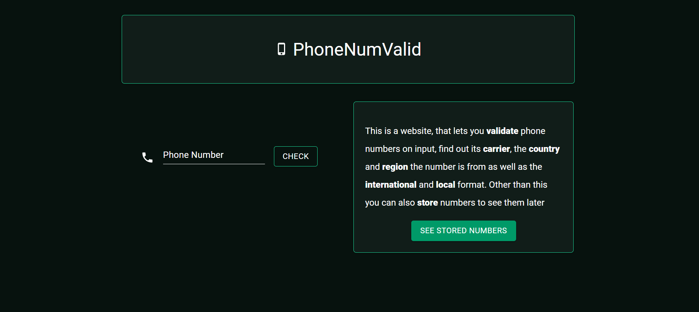
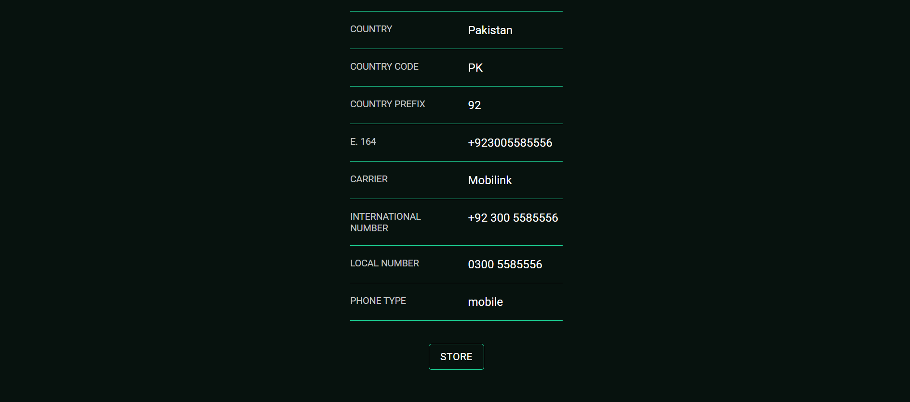
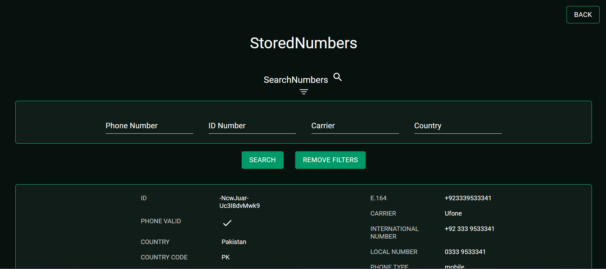

# PhoneNumValid, a website that lets you validate phone numbers

## uses Veriphone API from the RapidAPI website to validate phone numbers, store and delete them, and search through saved numbers

## [View the website live](https://phonenumvalid.web.app)

This website gives information like the phone carrier, international number format, local number format, the country the number is from, the ES6 format, the country code and the phone type. The website was made using these steps

<p align="center">
    
</p>

- fetching data from the Veriphone API after registering on the site
- making the API call when a phone number is entered to verify
- the data of the phone is extracted from the API and displayed, as well as a button that lets you store the number in the firebase database using axios

<p align="center">
    
</p>

- a button is added to take you to the page that has all the stored numbers

<p align="center">
    
</p>
  
- to filter through the numbers in the database a search option is made with input fields that let you filter accordingly
- they can also be deleted using the delete button with each number 

## Technologied Used

- [](https://reactjs.org/)
- [](https://www.w3.org/Style/CSS/Overview.en.html)
- [](https://axios-http.com/)
- [](https://material-ui.com/)
- [](https://firebase.google.com/)


## Click in the link to watch a video tutorial of the website!
[website tutorial](https://youtu.be/ks91pz3tJf0?si=Dx0dhKz28sT1jjr3)

## How to get the project working on your device

- clone the repository
   ```sh
   git clone https://github.com/your_username_/Project-Name.git
   ```
- navigate to the project directory and install all dependencies
  ```sh
   npm install
   ```
- create an account on rapid API
- go to the Veriphone API and subscribe to it [Veriphone API](https://rapidapi.com/Veriphone/api/veriphone)
- copy your API key and replace it with the API key currently in the project
- run the project
   ```sh
     npm start
     ```

## Important Notes
- if no data is rendered when a phone number is entered, it would be because the monthly quota of 500 requests(fixed) have been used up
